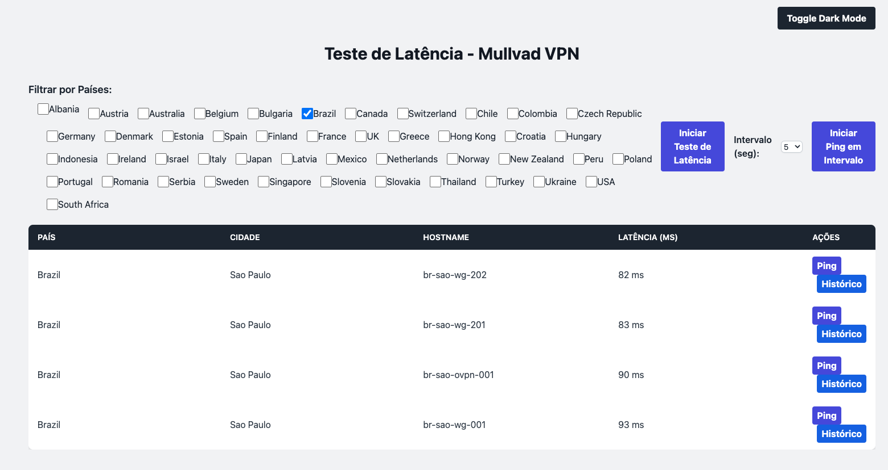

# Mullvad VPN Latency Test
This script tests the latency of Mullvad VPN servers. It uses the `ping` command to measure the latency of each server. The script will output the latency of each server in milliseconds. The script runs on the backend because it uses the `ping` command as the server doesn't provide http or other protocol that may be used to request something and calculate the latency. And i don't know how to ping a server from the frontend.

Done in +/- 15 minutes.

# How to run the script

1. Clone the repository
```bash
git clone git@github.com:juniorsaldanha/mullvad-vpn-latency-test.git
```
or for https
```bash
git clone https://github.com/juniorsaldanha/mullvad-vpn-latency-test.git
```
2. Run the script using the following command:
This will run the software in background mode, you can stop it later using the `make stop-run` command.
```bash
make run
```
or if you don't have `make` installed or you don't want to have it running on your background:
```bash
go run cmd/api/main.go
```
3. Access the following URL in your browser:
```
http://localhost:8080/
```
4. To Stop the server use the following command:
```bash
make stop-run
```
or press `Ctrl + C` in the terminal where the server is running if you have used the `go run ...` command.

# Screenshots


# How to contribute
1. Fork the repository
2. Create a new branch
3. Make your changes
4. Push your changes to your fork
5. Create a pull request :)

# License
This project is licensed under the MIT License - see the [LICENSE](LICENSE) file for details.
